<h1 align="center">🔐 Networkwalks Cybersecurity — Penetration Testing Report</h1>

<div align="center">

**Footprinting, Reconnaissance & Network Scanning — Week 2 Final Assessment**

**W2-PM-FINAL | CYBERSECURITY | NETWORKWALKS**

</div>

<p align="center">


</p>

## PENTESTER INFORMATION

| Field | Details |
|---|---|
| **Pentester Name** | Tanjan Singh Karki |
| **Role** | Cybersecurity Professional / Intern |
| **Program / Batch** | B082 – Networkwalks |
| **Assessment Period** | Week 2 |
| **Modules Completed** | W2-PM1, W2-PM2, W2-PM3, W2-PM4, W2-PM5 |
| **Primary Tools** | Kali Linux, WHOIS, WhatWeb, Nslookup, cURL, Wafw00f, DNSRecon, GHDB, Maltego, theHarvester, Zenmap/Nmap |
| **Client / Target** | Networkwalks and assigned training targets |
| **Authorization** | Activities involving the Networkwalks target were performed within the assigned authorized training scope. Third-party/public-data exercises were conducted as part of the assigned educational module. |
| **Phases Covered** | Phase 1: Reconnaissance & Footprinting; Phase 2: Scanning & Network Discovery |
| **Assessment Status** | Reconnaissance and network discovery completed |

## 1. LIABILITY DISCLAIMER

All security testing and reconnaissance activities documented in this report were performed for authorized educational, research, and cybersecurity training purposes.

Testing against the Networkwalks target was performed within the assigned scope and with the required permission. Local network scanning was performed against the tester's own local network.

Public-information and search-engine-based exercises were conducted as part of the assigned cybersecurity training modules. No attempt was made to gain unauthorized access to systems, bypass authentication, modify data, disrupt services, or exploit identified systems.

The information contained in this report is intended for educational and professional cybersecurity purposes only. Unauthorized reconnaissance, scanning, access, exploitation, or interference with computer systems may violate applicable laws and regulations. The tester is responsible for ensuring that appropriate authorization and scope are established before conducting security testing.

The findings documented in this report should not automatically be interpreted as confirmed vulnerabilities. Information disclosure, technology identification, DNS records, live hosts, and publicly indexed resources may provide useful intelligence to an attacker but require further authorized validation before being classified as exploitable security vulnerabilities.

## 2. INTRODUCTION

This report documents the Week 2 cybersecurity practical activities completed as part of the Networkwalks cybersecurity training program. The activities focused primarily on **reconnaissance, footprinting, information gathering, and network discovery**. Multiple Kali Linux tools were used to collect publicly available information about the networkwalks.com domain, while additional exercises demonstrated Google Hacking Database (GHDB) techniques, Maltego-based reconnaissance, and theHarvester-based information gathering.

The final activity involved **network scanning with Zenmap/Nmap** against the tester's own local LAN. The purpose was to identify the local network range, discover active hosts, identify their IP and MAC addresses, and generate a network topology. The assessment therefore demonstrated two important stages of a penetration-testing methodology:

1. **Reconnaissance and Footprinting** – collecting information about domains, infrastructure, technologies, DNS records, email addresses, hosts, and publicly indexed resources.
2. **Scanning and Network Discovery** – identifying live systems and understanding the structure of a local network.

The practical exercises demonstrated that an attacker can build a significant picture of a target environment before performing any exploitation. Publicly available information such as DNS records, web technologies, domain information, email addresses, and indexed resources can contribute to an organization's attack surface.

## 3. OBJECTIVES

The main objectives of the Week 2 activities were:

- Identify publicly available domain registration information.
- Fingerprint technologies used by a web application.
- Resolve domain names to their associated IP addresses.
- Analyze HTTP response headers.
- Identify whether a Web Application Firewall is present.
- Enumerate DNS records and associated infrastructure.
- Understand Google Dorking/GHDB-based information discovery.
- Practice reconnaissance using Maltego.
- Identify email addresses and hosts using theHarvester.
- Understand the limitations of reconnaissance sources and API-dependent tools.
- Identify the local IP address and subnet.
- Discover live hosts within the local network.
- Collect IP and MAC address information.
- Generate a network topology using Zenmap.
- Document reconnaissance findings and their potential security impact.

## 4. TOOLS USED

| **Tool** | **Purpose** |
|---|---|
| **Kali Linux** | Primary operating system for reconnaissance and security testing |
| **WHOIS** | Collect domain registration, registrar, status, and name-server information |
| **WhatWeb** | Identify web technologies, frameworks, CMS, server information, and related technologies |
| **Nslookup** | Resolve domain names to IP addresses using DNS |
| **cURL (curl -I)** | Inspect HTTP response headers |
| **Wafw00f** | Identify the presence and type of Web Application Firewall |
| **DNSRecon** | Enumerate DNS records and related infrastructure |
| **Google Hacking Database / GHDB** | Demonstrate search-engine-based information discovery |
| **Maltego** | Perform graphical reconnaissance and relationship-based information gathering |
| **theHarvester** | Gather publicly available email addresses, hosts, IP addresses, and related information |
| **Zenmap / Nmap** | Discover live hosts and network devices |
| **Windows CMD** | Identify local IP address and subnet configuration |

## 5. ACTIVITIES PERFORMED

### 5.1 FOOTPRINTING & RECONNAISSANCE WITH MULTIPLE KALI TOOLS

The first practical module focused on footprinting and reconnaissance against the networkwalks.com domain using multiple Kali Linux tools.

The purpose was to understand how different tools provide different pieces of information about the same target. Rather than relying on a single source, the assessment combined WHOIS, WhatWeb, Nslookup, cURL, Wafw00f, and DNSRecon.

### 5.1.1 WHOIS – DOMAIN REGISTRATION INFORMATION

**Command Used:** `whois networkwalks.com`

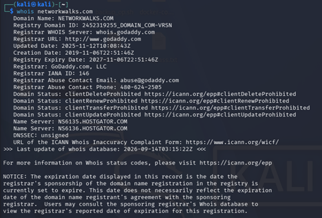

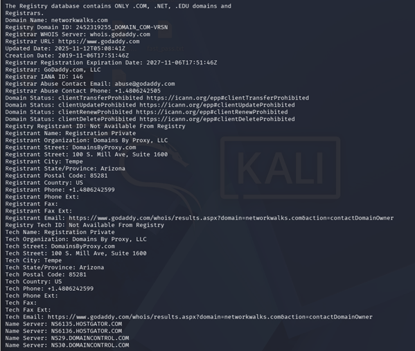

The WHOIS query returned domain registration information for networkwalks.com. The observed information included:

- **Domain:** NETWORKWALKS.COM
- **Registrar:** GoDaddy.com, LLC
- **Creation Date:** 6 November 2019
- **Updated Date:** 12 November 2025
- **Registry Expiry:** 6 November 2027
- **Registrant:** Registration Private
- **Registrant Organization:** Domains By Proxy, LLC
- **Name Servers:** NS6135.HOSTGATOR.COM and NS6136.HOSTGATOR.COM
- Additional registrar-related name servers were also present.
- **DNSSEC:** Unsigned

The WHOIS data indicates that domain registration privacy is being used, so direct registrant identity information is not publicly exposed in the returned record.

**Security Relevance**

WHOIS information can assist an attacker in establishing the administrative and infrastructure profile of a domain. Registrar, name-server, registration dates, and related information can be combined with other reconnaissance sources.

In this case, the use of registration privacy reduces the amount of directly identifiable registrant information available through WHOIS.

**Risk Assessment:** Low

### 5.1.2 WHATWEB – WEB TECHNOLOGY FINGERPRINTING

**Command Used:** `whatweb networkwalks.com`

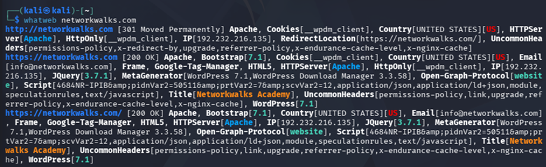

WhatWeb identified several technologies and characteristics associated with the website. The HTTPS result identified:

- **Apache** web server
- **WordPress 7.1**
- **WordPress Download Manager 3.3.58**
- **Bootstrap 7.1**
- **jQuery 3.7.1**
- Google Tag Manager
- HTML5
- Open Graph Protocol
- WordPress-related information
- IP address 192.232.216.135
- Website title: **Networkwalks Academy**
- `__wpdm_client` cookie
- Several uncommon HTTP headers

The HTTP version of the request also returned a 301 Moved Permanently redirect to HTTPS.

**Security Relevance**

Technology fingerprinting can provide attackers with information about the software stack being used by a target. If a specific CMS, plugin, framework, or version contains a known vulnerability, the exposed information can help an attacker prioritize further investigation.

However, identifying WordPress or a plugin does **not itself prove that the installation is vulnerable**. Vulnerability confirmation would require authorized version verification and security testing.

**Risk Assessment:** Medium

### 5.1.3 NSLOOKUP – DNS RESOLUTION

**Command Used:** `nslookup networkwalks.com`

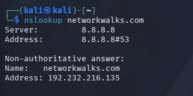

The DNS query was performed using Google's DNS resolver:

```text
Server: 8.8.8.8
```

The result returned:

```text
Name:    networkwalks.com
Address: 192.232.216.135
```

Therefore, the observed IP address associated with the domain was: **192.232.216.135**

**Security Relevance**

Knowing the IP address behind a domain can help security professionals understand the hosting infrastructure and can provide an attacker with an additional technical identifier for further authorized reconnaissance.

The IP address itself is not a vulnerability.

**Risk Assessment:** Low

### 5.1.4 cURL – HTTP RESPONSE HEADER ANALYSIS

**Command Used:** `curl -I https://networkwalks.com`

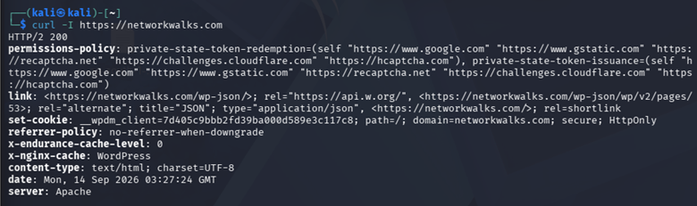

The server returned: HTTP/2 200

The response contained several HTTP headers, including:

- permissions-policy
- link
- set-cookie
- referrer-policy
- x-endurance-cache-level
- x-nginx-cache
- content-type
- date
- server: Apache

The Link header also exposed WordPress REST API-related paths, including: `/wp-json/` and a WordPress pages API endpoint.

**Security Relevance**

HTTP response headers can reveal information about the web-server architecture, caching mechanisms, application framework, and available application interfaces.

The WordPress REST API reference is expected behavior for many WordPress installations and is **not automatically a vulnerability**. Nevertheless, exposed application endpoints can provide useful information during authorized application reconnaissance.

**Risk Assessment:** Low

### 5.1.5 WAFW00F – WEB APPLICATION FIREWALL DETECTION

**Command Used:** `wafw00f networkwalks.com`

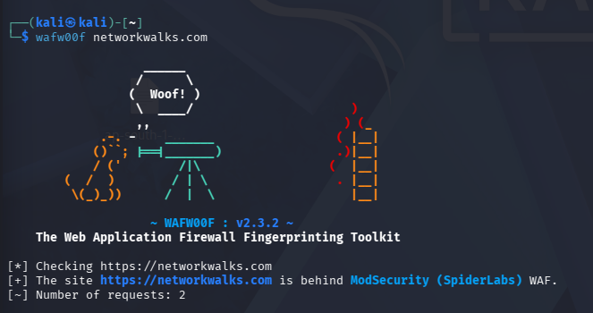

Wafw00f identified: The site https://networkwalks.com is behind ModSecurity (SpiderLabs) WAF. The tool completed the detection using two requests.

**Security Relevance**

The presence of a Web Application Firewall is a positive defensive control because it can provide an additional layer of protection between web applications and potentially malicious traffic.

However, WAF fingerprinting also informs an attacker about the defensive technology being used. Knowledge of the WAF may influence how future authorized testing is conducted.

The presence of ModSecurity should therefore be considered a **security control**, rather than a vulnerability.

**Risk Assessment:** Low / Informational

### 5.1.6 DNSRECON – DNS INFRASTRUCTURE ENUMERATION

**Command Used:** `dnsrecon -d networkwalks.com`

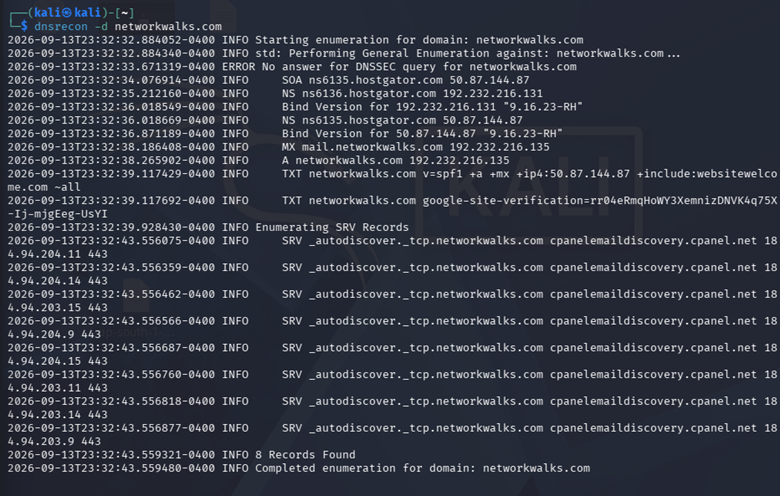

DNSRecon returned several types of DNS information.

**Observed Records**

**SOA:**

```text
ns6135.hostgator.com
50.87.144.87
```

**Name Servers:**

```text
ns6136.hostgator.com
192.232.216.131

ns6135.hostgator.com
50.87.144.87
```

**Mail Server:**

```text
mail.networkwalks.com
192.232.216.135
```

**A Record:**

```text
networkwalks.com
192.232.216.135
```

**SPF/TXT Record:**

```text
v=spf1 +a +mx +ip4:50.87.144.87 +include:websitewelcome.com ~all
```

A Google site-verification TXT record was also identified.

DNSRecon additionally identified SRV records associated with email autodiscovery and returned eight SRV records pointing to cPanel email-discovery infrastructure.

**Security Relevance**

DNS information provides an attacker with a broader understanding of an organization's infrastructure.

Name servers, mail servers, service records, and SPF information can help establish relationships between different services and infrastructure components.

DNSRecon also reported that the DNSSEC query received no answer. This should be treated as an observation rather than a confirmed vulnerability.

**Risk Assessment:** Medium

### 5.2 GHDB-BASED FOOTPRINTING & RECONNAISSANCE

The second practical module introduced Google Hacking Database techniques for discovering publicly indexed resources. The exercise demonstrated how carefully constructed search operators can locate specific types of publicly indexed content. The practical included searches relating to exposed or publicly accessible webcam interfaces and downloadable mathematics resources.

**10x live vulnerable security camera links:**

| No. | Link | Relevant Dork | Username / Password (if any) |
|---:|---|---|---|
| 1 | https://tuwebcam.towson.edu/index.html | `intitle:"Webcam" inurl:WebCam.htm` | Not provided |
| 2 | http://189.1.167.124:4321/ | `intitle:"Webcam" inurl:WebCam.htm` | Not provided |
| 3 | https://www.skylinewebcams.com/en/webcam/italia/lazio/roma/campo-de-fiori.html | `inurl:webcam site:skylinewebcams.com inurl:roma` | Not provided |
| 4 | http://109.233.191.130:8080/ | `intitle:"webcamXP" inurl:8080` | Not provided |
| 5 | http://109.206.96.75:8080/multi.html | `intitle:"webcamXP" inurl:8080` | Not provided |
| 6 | http://68.115.218.130:32479/multi.html | `inurl:/multi.html intitle:webcam` | Not provided |
| 7 | http://webcam.turboprop.com/ | `intitle:"NetCamSC*"` | Not provided |
| 8 | http://ldeo-phenocam-stardot.ldeo.columbia.edu/ | `intitle:"NetCamSC*"` | Not provided |
| 9 | http://50.184.100.114:8000/ | `intitle:"NetCamSC*"` | Not provided |
| 10 | http://www.insecam.org/en/view/508606/ | `inurl:"view.shtml" "camera"` | Not provided |

**10x listings which contain downloadable mathematics ebooks in PDF format:**

| No. | Link | Relevant Dork | Username / Password (if any) |
|---:|---|---|---|
| 1 | http://erewhon.superkuh.com/library/Math/ | `intitle:index.of "parent directory" mathematics pdf` | Not provided |
| 2 | https://www.unm.edu/~megrad/Math/ | `intitle:index.of "parent directory" mathematics pdf` | Not provided |
| 3 | https://www.netlib.org/math/docpdf/ | `intitle:index.of "parent directory" mathematics pdf` | Not provided |
| 4 | https://education.giakonda.org.uk/Maths/?SD | `intitle:index.of "parent directory" mathematics pdf` | Not provided |
| 5 | http://inis.jinr.ru/sl/vol2/Mathematics/Math.Encyclopedia/Pdf/ | `intitle:index.of "parent directory" mathematics pdf` | Not provided |
| 6 | https://www.learn-fo.com/FYUG%20mathematics%20solutions/?SD | `intitle:index.of "parent directory" mathematics pdf` | Not provided |
| 7 | https://case.edu/artsci/math/singer/publish/ | `intitle:index.of "parent directory" mathematics pdf` | Not provided |
| 8 | https://maths.nuigalway.ie/~rquinlan/linearalgebra/ | `intitle:index.of "parent directory" mathematics pdf` | Not provided |
| 9 | https://pcwww.liv.ac.uk/maths/ | `intitle:index.of "parent directory" mathematics pdf` | Not provided |
| 10 | https://jasoncantarella.com/downloads/?C=N;O=D | `intitle:index.of "parent directory" mathematics pdf` | Not provided |
| 11 | https://ochicken.net/library/Mathematics/ | `intitle:index.of "parent directory" mathematics pdf` | Not provided |

The exercise also identified publicly indexed mathematics PDF directories and library listings. The collected results included university, educational, research, and mathematics-resource locations.

**Security Relevance**

GHDB techniques demonstrate that information unintentionally indexed by search engines can increase an organization's external attack surface.

For security teams, this highlights the importance of:

- Reviewing publicly indexed content.
- Removing sensitive or unnecessary files from public locations.
- Avoiding exposure of administrative interfaces.
- Securing Internet-facing cameras and IoT devices.
- Using authentication and access controls.
- Regularly monitoring search-engine exposure.

The discovery of an indexed resource does not automatically mean that the underlying system is vulnerable. Each finding requires ownership verification, authorization, and controlled validation before any security conclusion is made.

**Risk Assessment:** Medium / Context Dependent

### 5.3 FOOTPRINTING WITH MALTEGO

The third practical module focused on Maltego.

**Task Performed**

Maltego was installed on a Windows computer as required by the practical. The next task was to identify email addresses associated with networkwalks.com within the authorized training scope.

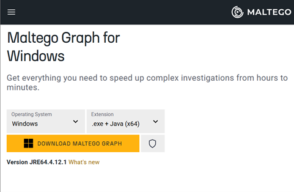

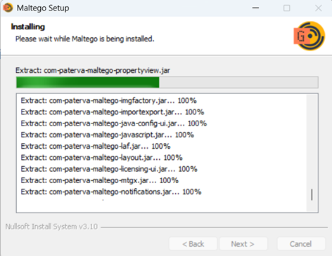

Maltego provides a graphical approach to reconnaissance by representing relationships between domains, people, organizations, infrastructure, email addresses, and other entities.


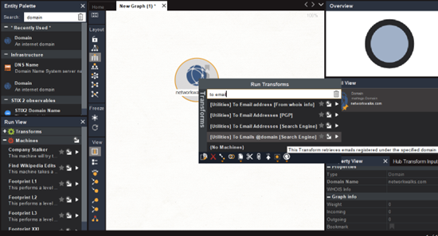

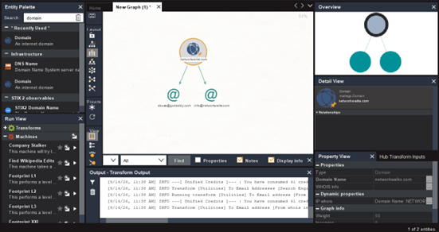

**Security Relevance**

Graph-based reconnaissance can help a security professional understand how apparently separate pieces of public information relate to one another. For defenders, this demonstrates the importance of controlling publicly exposed organizational information and regularly reviewing the organization's external footprint. The supplied practical data does not contain a completed list of Maltego-discovered email addresses; therefore, no additional email findings are claimed in this report.

**Risk Assessment:** Informational

### 5.4 FOOTPRINTING WITH THEHARVESTER

The fourth module focused on using theHarvester to collect publicly available information associated with microsoft.com.

#### 5.4.1 BAIDU SEARCH – LIMIT 1000

**Command Used:** `theHarvester -d microsoft.com -l 1000 -b Baidu`

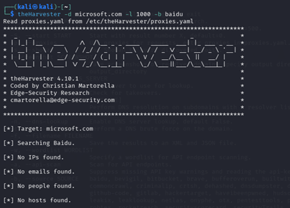

The result returned: No IPs found. No emails found. No people found. No hosts found.

Therefore, no useful results were obtained with the specified limit of 1000.

#### 5.4.2 BAIDU SEARCH – LIMIT 2000

The search was repeated using: `theHarvester -d microsoft.com -l 2000 -b Baidu`

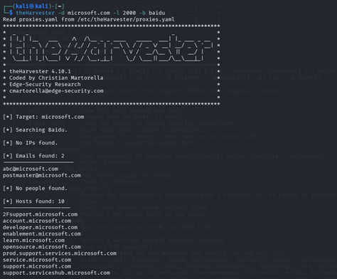

This produced:

**Emails**

Two email addresses were returned:

- abc@microsoft.com
- postmaster@microsoft.com

**Hosts**

Ten hosts were returned, including:

- 2Fsupport.microsoft.com
- account.microsoft.com
- developer.microsoft.com
- enablement.microsoft.com
- learn.microsoft.com
- opensource.microsoft.com
- prod.support.services.microsoft.com
- service.microsoft.com
- support.microsoft.com
- support.serviceshub.microsoft.com

#### 5.4.3 THEHARVESTER USING ALL SOURCES

**Command Used:** `theHarvester -d microsoft.com -l 50 -b all`

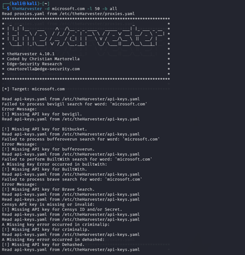

The all-source scan demonstrated an important limitation of automated reconnaissance tools: many sources require API credentials. The output showed missing or invalid API keys for several services, including sources associated with:

- GitHub
- Shodan
- Censys
- Hunter
- VirusTotal
- SecurityTrails
- IntelX
- DNSDumpster
- BuiltWith
- Brave
- FullHunt
- ProjectDiscovery
- and other services.

Despite these limitations, several sources returned useful information.

The scan reported:

- **142 IPs**
- **9968 hosts**
- **3 emails**
- **7 ASNs**
- **2 interesting URLs**
- **43 hosts from the Hudson Rock processing stage**

The three email addresses reported by the completed scan were:

- dotnet-docker-bot@microsoft.com
- opencode@microsoft.com
- secure@microsoft.com

The tool also reported 14 subdomains through a DNS fallback mechanism.

**Security Relevance**

TheHarvester demonstrates how information from multiple public sources can be combined to create a large external footprint. The exercise also demonstrated that reconnaissance results depend heavily on:

- Search-engine coverage.
- API availability.
- API credentials.
- Source reliability.
- Rate limits.
- Tool configuration.
- Current availability of external services.

Therefore, automated reconnaissance results should be treated as intelligence that requires verification rather than as a definitive inventory.

**Risk Assessment:** Informational / Medium depending on the sensitivity of exposed information

### 5.5 NETWORK SCANNING WITH ZENMAP / NMAP

The fifth module focused on network scanning and host discovery using Zenmap. The assessment was performed against the tester's own local network.

#### 5.5.1 ZENMAP INSTALLATION

Zenmap/Nmap was installed on the Windows PC using the official Nmap distribution as required by the practical.

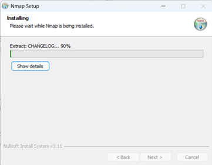

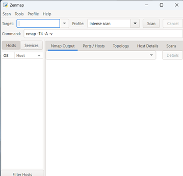

The practical installation source was:

`https://nmap.org/dist/nmap-7.991-setup.exe`

#### 5.5.2 LOCAL IP ADDRESS AND SUBNET

The local network configuration identified:

```text
IPv4 Address: 192.168.18.184
Subnet Mask: 255.255.255.0
```

This corresponds to the local subnet:

```text
192.168.18.0/24
```

A /24 network provides 256 total IPv4 addresses, including network and broadcast addresses, with the usable host range generally being 192.168.18.1 through 192.168.18.254. The practical scan therefore examined the local /24 network.

#### 5.5.3 LIVE HOST DISCOVERY

The Nmap scan identified **10 live hosts** on the local network. The scan completed with:

```text
Nmap done: 256 IP addresses (10 hosts up) scanned in 4.07 seconds
```

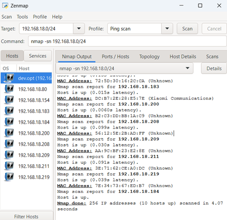

The discovered hosts were:

| **SN** | **IP Address** | **MAC Address** | **Observed Vendor** |
|---:|---|---|---|
| 1 | 192.168.18.80 | 1C:3C:D4:49:8B:9A | Huawei Technologies |
| 2 | 192.168.18.154 | 06:2C:82:F5:50:6C | Unknown |
| 3 | 192.168.18.183 | 72:5D:30:16:2C:CA | Unknown |
| 4 | 192.168.18.200 | DC:B7:2E:28:E5:7E | Xiaomi Communications |
| 5 | 192.168.18.208 | B2:C3:DD:BB:1A:C9 | Unknown |
| 6 | 192.168.18.209 | 56:12:5E:2B:AD:FF | Unknown |
| 7 | 192.168.18.211 | AA:9C:BF:23:E2:8E | Unknown |
| 8 | 192.168.18.219 | 3E:71:62:CE:A0:DC | Unknown |
| 9 | 192.168.18.184 | 7E:34:73:67:ED:B7 | Unknown |
| 10 | 192.168.18.1 | Not returned in the provided output | Local scanning system |

The Nmap results explicitly identified the first ten hosts with MAC addresses and showed the scanning system at 192.168.18.184 as a live host.

**Security Relevance**

Live host discovery is an important internal reconnaissance activity. From a defensive perspective, identifying all active devices helps organizations determine:

- Which devices are connected to the network.
- Whether unauthorized devices are present.
- Whether network inventory records are accurate.
- Whether segmentation is working as expected.
- Which systems may require additional security assessment.

The presence of an unknown MAC-vendor result does **not** automatically indicate a malicious or unauthorized device. Modern operating systems and mobile devices can use randomized MAC addresses, which can cause vendor identification to be unavailable or inaccurate.

**Risk Assessment:** Medium if unidentified devices are not accounted for; otherwise Informational.

#### 5.5.4 NETWORK TOPOLOGY

The final Zenmap task required displaying and saving the discovered network topology in PDF format. The topology provides a visual representation of the discovered network environment and assists in understanding relationships between the scanning system and detected hosts.

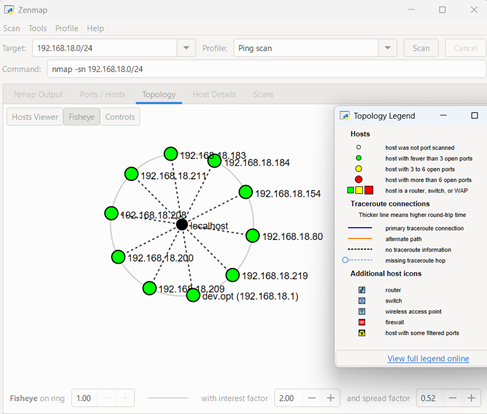

The topology output should be retained as assessment evidence together with the corresponding Zenmap scan results.

## 6. CONSOLIDATED FINDINGS AND RISK ANALYSIS

Based on the reconnaissance and network-discovery activities, the following observations were identified.

| **SN** | **Finding / Observation** | **Evidence** | **Potential Impact** | **Risk** |
|---:|---|---|---|---|
| 1 | Web technologies are fingerprintable | WhatWeb identified WordPress 7.1 and WordPress Download Manager 3.3.58 | May assist attackers in identifying technologies for further research | **Medium** |
| 2 | Public IP address is identifiable | networkwalks.com → 192.232.216.135 | Provides an infrastructure identifier for further reconnaissance | **Low** |
| 3 | WordPress API information is visible in headers | cURL exposed /wp-json/ and related API references | May assist application enumeration | **Low** |
| 4 | Web server information is exposed | HTTP response contained server: Apache | Provides limited technology fingerprinting information | **Low** |
| 5 | WAF technology is fingerprintable | Wafw00f identified ModSecurity (SpiderLabs) | Reveals part of the defensive architecture | **Low / Informational** |
| 6 | DNS infrastructure is externally observable | DNSRecon identified NS, SOA, MX, TXT and SRV records | Helps construct an infrastructure profile | **Medium** |
| 7 | DNSSEC query returned no answer | DNSRecon reported no answer for DNSSEC query | May warrant configuration review, but is not a confirmed vulnerability | **Low / Informational** |
| 8 | Publicly indexed resources can be discovered | GHDB exercises returned camera/resource URLs | Poorly controlled public resources may increase attack surface | **Medium / Context Dependent** |
| 9 | Public email/host information can be aggregated | theHarvester returned emails and hosts | May assist phishing, enumeration, or infrastructure profiling | **Medium** |
| 10 | Multiple live devices exist on local LAN | Zenmap identified 10 live hosts | Unmanaged or unauthorized devices could increase internal attack surface | **Medium** |

The findings represent reconnaissance observations and potential risks. **No confirmed exploitable vulnerability was established during these modules.**

## 7. RECOMMENDATIONS

### 7.1 Review Public Technology Exposure

Regularly review publicly exposed web-server, CMS, plugin, framework, and application information. Where technically appropriate, minimize unnecessary version disclosure while maintaining compatibility and operational requirements.

### 7.2 Maintain Current Software

WordPress, WordPress plugins, JavaScript libraries, server software, and other externally exposed components should be maintained using an appropriate patch-management process. The identified versions should be reviewed against current vendor security advisories before any vulnerability conclusion is made.

### 7.3 Review HTTP Security Headers

HTTP response headers should be periodically reviewed to ensure that:

- Unnecessary technical information is minimized.
- Appropriate security policies are configured.
- Cookie attributes are appropriate.
- Referrer and permissions policies meet organizational requirements.

### 7.4 Review DNS Records

Organizations should periodically audit DNS records to ensure that:

- Only required records are publicly available.
- Old records are removed.
- Mail records are correct.
- SRV records are necessary.
- SPF records are correctly configured.
- DNS infrastructure is properly documented.

DNSSEC configuration should also be reviewed according to the organization's requirements.

### 7.5 Maintain and Monitor the WAF

The identified ModSecurity WAF should remain properly configured and monitored.

Security teams should:

- Keep WAF rules updated.
- Monitor blocked and allowed requests.
- Review false positives.
- Tune rules according to application requirements.
- Integrate WAF logs with centralized monitoring where possible.

### 7.6 Monitor Search-Engine Exposure

Organizations should periodically review search-engine indexing for:

- Administrative interfaces.
- Development systems.
- Backup files.
- Sensitive documents.
- Internal information.
- Exposed cameras or IoT systems.
- Unintentionally public directories.

Search-engine exposure should be considered part of external attack-surface management.

### 7.7 Secure Internet-Facing Cameras and IoT Devices

Internet-facing cameras and IoT devices should:

- Require strong authentication.
- Use current firmware.
- Disable unnecessary Internet exposure.
- Avoid default credentials.
- Restrict access using firewall or network controls.
- Be placed on appropriately segmented networks.

### 7.8 Control Publicly Exposed Documents

Organizations should maintain an inventory of publicly accessible files and directories.

Sensitive or unnecessary files should be removed or access-controlled, and search-engine indexing should be reviewed where appropriate.

### 7.9 Maintain an Accurate Asset Inventory

Internal networks should be scanned periodically to identify active devices. Every discovered device should be associated with:

- An owner.
- A business purpose.
- A known IP address.
- A known device identity.
- Appropriate security controls.

### 7.10 Investigate Unknown Devices

The local scan returned several devices whose MAC vendors were reported as unknown. This does not prove that the devices are unauthorized. However, network administrators should verify unknown devices against the organization's approved asset inventory.

### 7.11 Use Continuous External Attack-Surface Monitoring

Organizations should periodically review their external footprint using authorized reconnaissance techniques.

Changes in:

- DNS records
- Subdomains
- IP addresses
- Public services
- Web technologies
- Cloud resources
- Public documents
- Email exposure

should be tracked over time.

### 7.12 Perform Security Testing Only Within Authorized Scope

Reconnaissance and scanning should always be performed against systems for which appropriate authorization has been obtained. The scope should clearly define:

- Target systems.
- IP ranges.
- Domains.
- Testing dates.
- Allowed techniques.
- Rate limits.
- Prohibited activities.
- Emergency contacts.

## 8. EVIDENCE SUMMARY

The following evidence was collected during the Week 2 activities.

**Evidence 1 – WHOIS**

WHOIS output demonstrating domain registration, registrar, domain status, and name-server information for networkwalks.com.

**Evidence 2 – WhatWeb**

WhatWeb output identifying Apache, WordPress 7.1, WordPress Download Manager 3.3.58, jQuery 3.7.1, Bootstrap, IP address, and other technologies.

**Evidence 3 – Nslookup**

DNS resolution showing:

`networkwalks.com → 192.232.216.135`

**Evidence 4 – cURL**

HTTP response headers obtained using:

```bash
curl -I https://networkwalks.com
```

including the WordPress `/wp-json/` reference and server information.

**Evidence 5 – Wafw00f**

Wafw00f identified ModSecurity (SpiderLabs) protecting the target website.

**Evidence 6 – DNSRecon**

DNSRecon output containing SOA, NS, MX, A, TXT and SRV records.

**Evidence 7 – GHDB**

Google Dorking results demonstrating discovery of publicly indexed webcam-related resources and mathematics PDF directories.

**Evidence 8 – Maltego**

Maltego installation and the assigned task for identifying email addresses related to networkwalks.com.

**Evidence 9 – theHarvester**

Baidu reconnaissance against microsoft.com, including the results obtained using limits of 1000 and 2000.

**Evidence 10 – theHarvester All Sources**

All-source reconnaissance showing API limitations and the final collection of IPs, hosts, emails, ASNs, and other information.

**Evidence 11 – Local Network Configuration**

Windows network configuration showing:

```text
IPv4 Address: 192.168.18.184
Subnet Mask: 255.255.255.0
```

**Evidence 12 – Zenmap/Nmap Host Discovery**

Nmap discovery showing 10 live hosts on the 192.168.18.0/24 network, including their observed IP and MAC addresses.

**Evidence 13 – Network Topology**

Zenmap topology was generated as required by the practical and should be attached to the final submission as the corresponding topology PDF/evidence.

## 9. CONCLUSION

During Week 2 of the Networkwalks Cybersecurity & Ethical Hacking program, I completed practical activities covering **footprinting, reconnaissance, information gathering, GHDB-based discovery, Maltego reconnaissance, theHarvester-based enumeration, and network scanning with Zenmap/Nmap**.

The footprinting phase demonstrated how multiple tools can provide complementary information about a target. WHOIS provided domain-registration information, WhatWeb identified technologies, Nslookup resolved the domain to its IP address, cURL exposed HTTP response information, Wafw00f identified the presence of ModSecurity, and DNSRecon provided additional DNS and infrastructure information.

The GHDB exercise demonstrated how search engines can unintentionally expose resources and how carefully constructed search operators can be used during authorized security assessments. The exercise emphasized the importance of monitoring an organization's public attack surface.

The Maltego exercise introduced graphical reconnaissance and demonstrated how relationships between domains, organizations, email addresses, and infrastructure can be investigated. TheHarvester further demonstrated how information from multiple public sources can be aggregated, while also showing the practical limitations created by missing API keys, unavailable services, and source-dependent results.

The network-scanning activity provided practical experience with internal host discovery. The local network was identified as 192.168.18.0/24, and **10 live hosts** were discovered. IP and MAC information was collected for the detected systems, and network topology generation was completed as required by the practical.

Overall, these exercises demonstrated that reconnaissance is a fundamental stage of cybersecurity assessment. Before exploitation is attempted, a security professional can often learn a considerable amount about an environment through publicly available information, DNS records, web responses, technology fingerprints, search engines, and network discovery.

The activities also reinforced an important professional principle: **a reconnaissance finding is not automatically a vulnerability**. Technology versions, IP addresses, DNS records, exposed headers, indexed resources, and unidentified hosts must be properly validated within an authorized scope before determining whether they represent an actual security weakness.

Finally, the exercises strengthened my understanding of structured penetration-testing methodology and security reporting. A professional assessment should clearly document the scope, tools, commands, observations, evidence, potential impact, risk level, and recommendations while maintaining strict authorization boundaries throughout the testing process.
